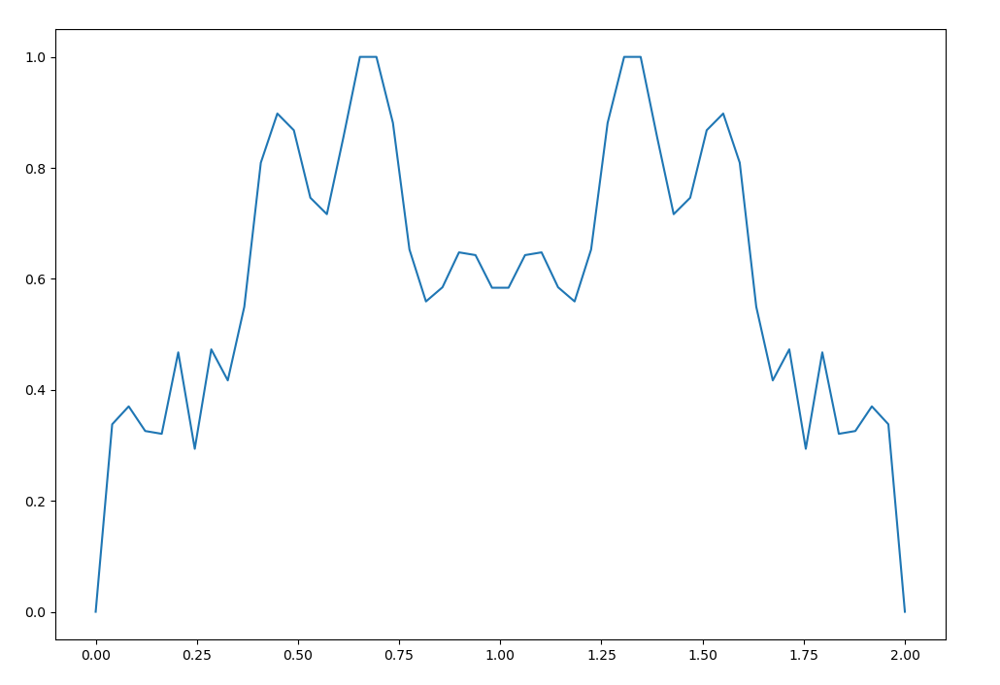
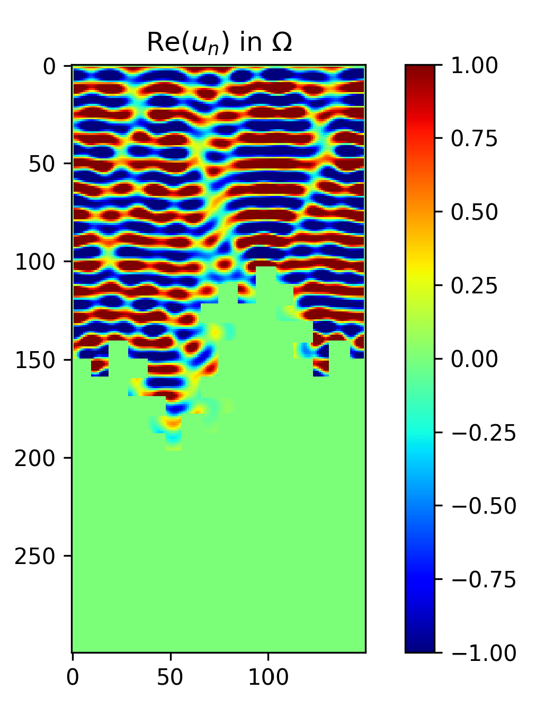
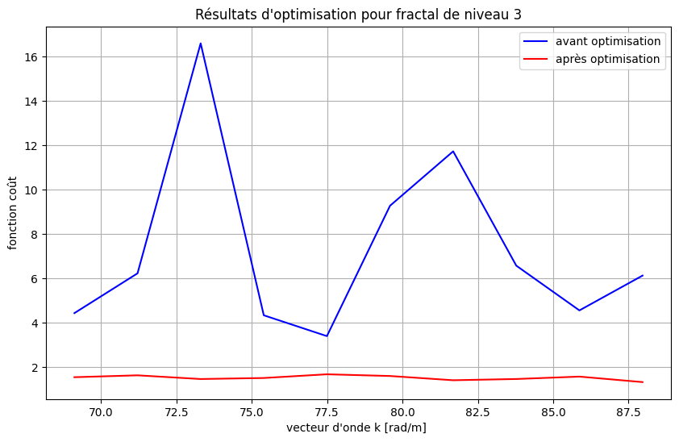

# Optimisation d’un Matériau Absorbant – Pollution Électromagnétique

Projet EI - ST5, novembre 2023  
Étude numérique de la pollution électromagnétique dans une cavité avec condition de radiation à l’air libre.

## Contexte

Ce projet modélise la propagation d'une onde électromagnétique dans une cavité ouverte. L'un des murs est remplacé par de l'air, introduisant une condition de radiation. On utilise une formulation variationnelle complexe et une méthode d’optimisation par descente de gradient pour minimiser une fonction d’énergie liée à l’amplitude du champ.

## Méthodes

- **Équations de Helmholtz** avec conditions de bord mixtes : Dirichlet, Neumann et radiation.
- **Décomposition réelle/imaginaire** du champ \( u = u_R + iu_I \).
- **Formulations variationnelles** pour \( u_R \), \( u_I \), et les adjoints \( p_R \), \( p_I \).
- **Discrétisation FEM** (éléments finis) avec raffinement spatial en fonction de la fréquence.
- **Algorithme de descente de gradient** avec projection pour imposer des contraintes sur \( \chi \).

## Résultats

📄 **[Lire le rapport de projet](Pollution_EM_EI.pdf)**

Les résultats présentés incluent :
- Le rapport
- Répartition optimale du matériau absorbant pour beta = 0.6
- Partie réelle de l'onde pour n = 6
- Comparaison de l'absorbtion en énergie avant et après optimisation du matériau

### 🔽 

